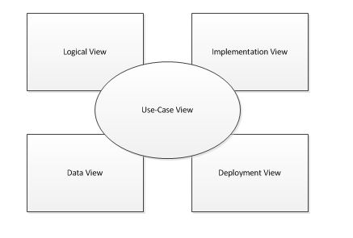
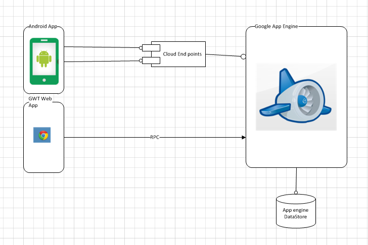
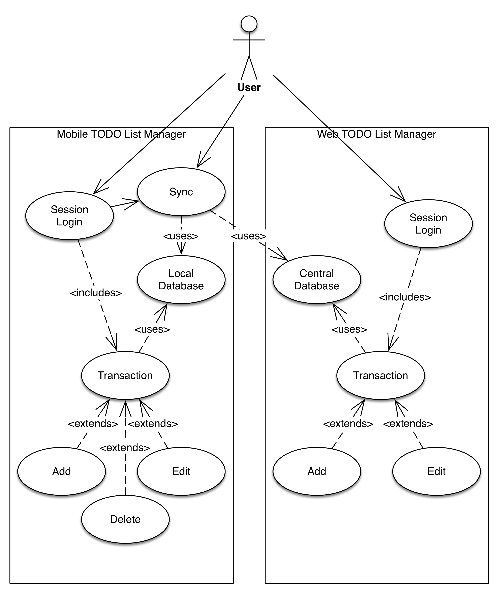
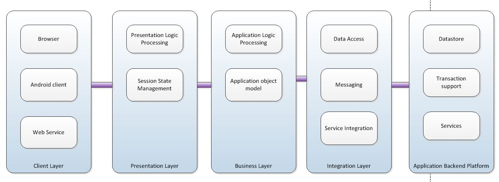
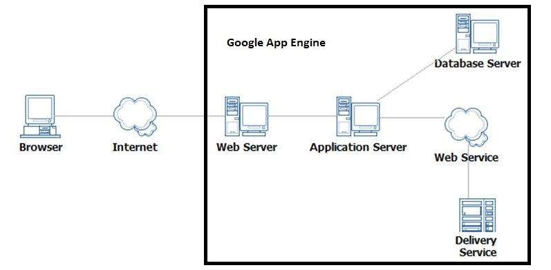
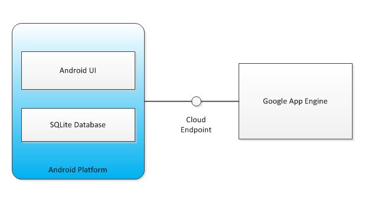
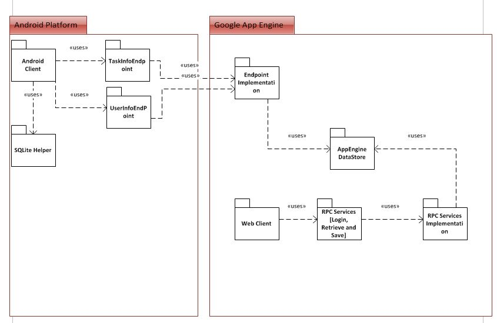

# Architecture - Project 3 – Team 25

# 1. Introduction #

This document describes the high level architecture for Project 3 of CS 6300 course implemented using the Rational Unified Process®.

## 1.1 Purpose ##

It covers the significant use-cases of the software system applicable for detailing the architecture, initial deployment model, key abstractions and design model. This document is intended to capture and convey significant architectural decisions which have been made regarding software system interfaces and their interactions with the platform. It presents a number of different architectural views to depict different aspects of the system.

## 1.2 Scope ##

Project 3 consists of building a web application client to an android application to manage "To Do" tasks and provide the capability to sync the data between these two clients bidirectionally. The scope of this document is to depict the architecture of the overall application system along with all applicable clients and back end infrastructure.

## 1.3 References ##

1. Vision document
1. UseCase document

# 2. Architectural Representation #

This document details the architecture using the below specified views using RUP naming convention. The views used to document this software system are:

**Logical View**
This view describes the system's object model. It also describes the most important use-case realizations.

**Implementation View**
This view describes the software components involved in implementing the system along with different layers and subsystems of the application.

**Deployment View**
This view describes the topology of the system and mapping of the software onto the hardware aspects with an emphasis on distributed aspects.

**Use Case View**
This view describes the set of scenarios and use cases that represent significant central functionality of the system.

**Data View**
This view describes the architecturally significant persistent elements in the data model.

# 3. Architectural Goals and Constraints #

This section describes the software requirements and objectives that have significant impact on the architecture.

## 3.1 Technical Platform ##

Web application will be deployed onto a J2EE application server. Google AppEngine will be used to handle .war deployment and also for providing persistent datastore services.

## 3.2 Transaction ##

Software system will leverage the Google App Engine technical platform capabilities to manage the transactions.

## 3.3 Security ##

The system must be secure so that multiple users can work with the system with username/password authentication and sensitive data such as passwords must be encrypted.

## 3.4 Persistence ##

Data persistence will be addressed using SQLite on Android platform and App Engine datastore on web platform.

## 3.5 Reliability / Failover ##

Availability of the system and failover support are provided by Google AppEngine infrastructure.

## 3.6 Performance ##

The performance of the web application and the bidirectional sync operation between the clients must provide interactive performance acceptable to users. The maximum processing time for any of the operations must be under 10 seconds.

# 4. Use-Case View #

The following are the architecturally significant use-cases of this system.

1. System allows the users to register with the application with a new username and password.
2. Once registered, Users access the system using an android client or web client using username/password authentication.
3. Users on android should be able to work with the system without necessarily having a data connection to web. This calls for local data storage on android system.
4. Users should be able to create and edit tasks either from the android client or web client.
5. Android client synchronizes the data presented to the users on android app with the central web server on start-up and on-demand.

# Logical View #

The software system is divided into the following logical layers.

# Deployment View #

Google App Engine HTTP Server will serve sync requests from the android client and also web UI requests to authenticate users, create and edit tasks. Google App Engine datastore stores the user and task related info and serves as the master data for web application. Sync operation updates the datastore to account for additions and modifications done locally using android client.

# Implementation View #

The implementation view depicts the physical composition of the implementation in terms of implementation sub-systems and  applicable interfaces.

# Data View #

The key data entities for the application are:

Users: This data entity consists of the following attributes

1. username: Captures the username of the user
2. password: Captures the encrypted password for this user
3. lastupdated: Timestamp of last update done to user info. This is needed for supporting the sync operation.

Tasks: This data entity consists of the following attributes

1. name: Name of the to-do task
2. note: Brief description of to-do task
3. priority: Low, Medium or High priority assigned to user task
4. due time: Due date associated with user task
5. no due time: Flag - no completion time indicated
5. status: Completion status of the task
6. last updated: Timestamp of last update done to task entity
7. userid: Owner of the task

