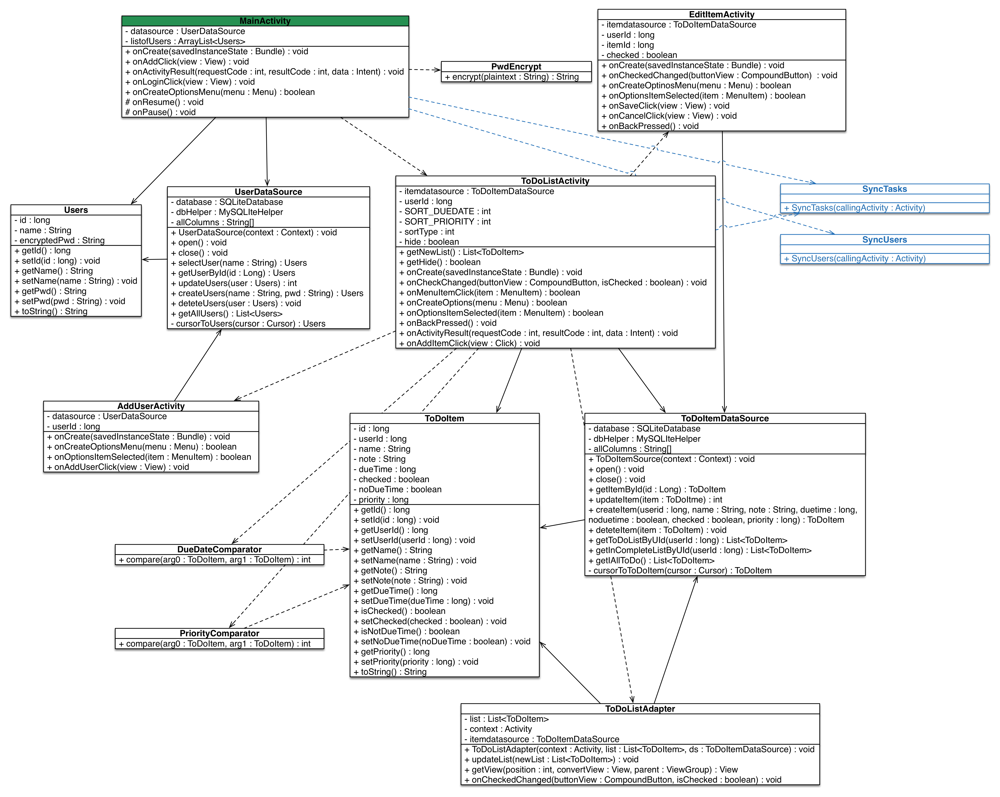
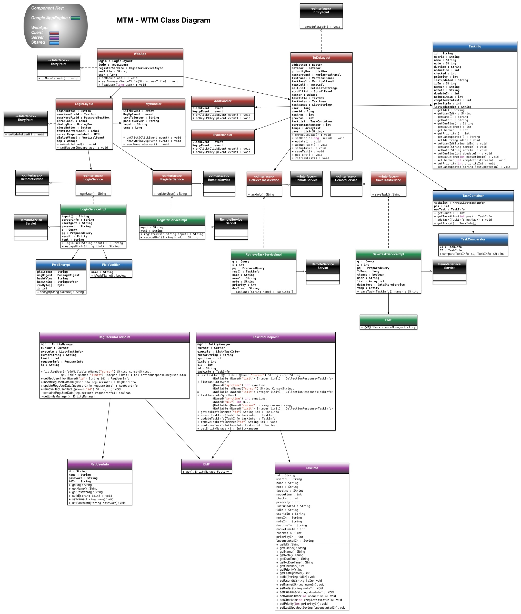
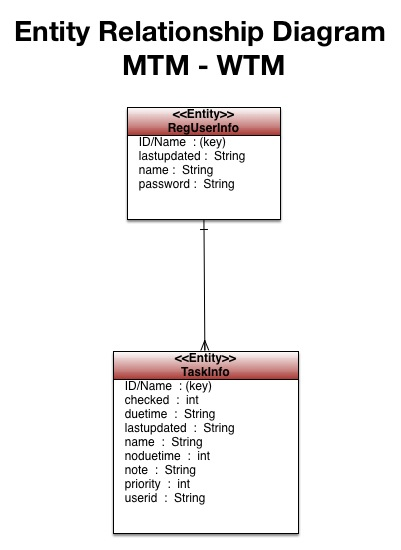
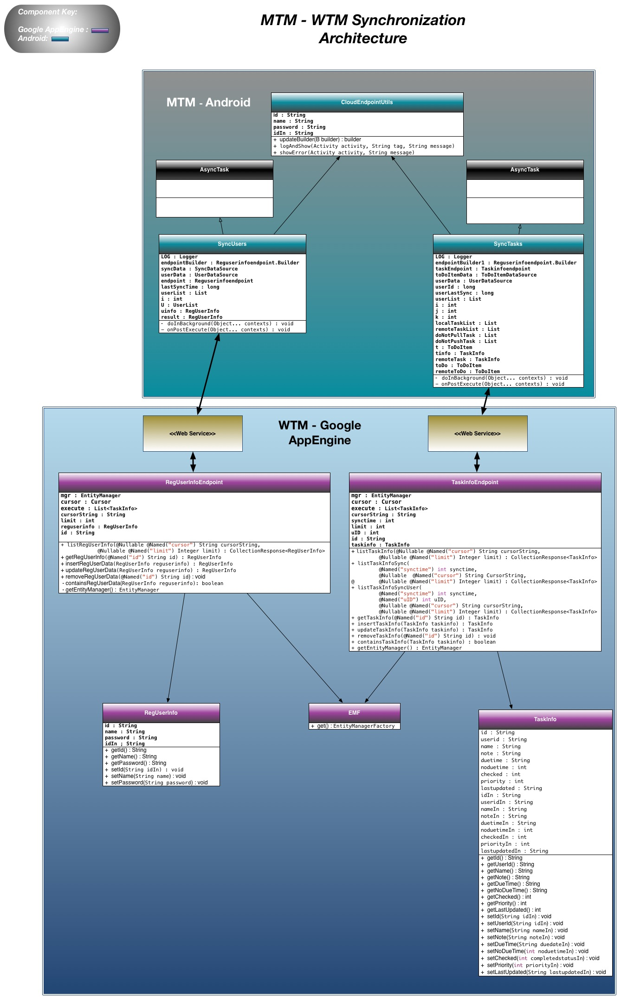

# Design - Project 3 – Team 25

## Overview

The objective of this project is two-fold:

1) Development of a web-based task management application (WTM) that has matching functionality to an existing Android-based mobile task management application (MTM). 

2) Extending the functionality of the MTM application to allow for syncing user data from the MTM to the WTM and two way synchronization of the task data between the two applications.

This document provides a description of technical design of the application, including the web application, the extensions to the Android app, and the architecture deployed for the synchronization of data between the two applications. 

## Reference Documents
The [architecture](architecture.md) document describes the high level architecture of the overall system.  This document describes lower-level details.

## MTM

The following design discussion is for the Android app.

### Sync

Per the vision document, use cases, and project description, the primary change to the MTM Android app is the addition of the cloud sync capability.  Per the system architecture document, the cloud based data store for the sync capability will be provided by Google App Engine.  This is accomplished by creating endpoints for the two primary datastores: taskinfo and reguserinfo. These endpoints are created and connected the the App Engine project and the application logic to write the local databases to App Engine is deployed. 

An important consideration is conflict management.  Since tasks can be edited on either the WTM or MTM, there is a possibility of conflicting data between the two stores.   Conflicts are managed by tracking the last edit time and the latest edit will always take priority.

There is also a possibility of user conflicts, so a unique user identifier is required.  This ID is generated from a precision time stamp.

Syncing is required to occur on app startup.  This is accomplished by calling the appropriate method in onCreate of the MainActivity.  The user has the option to manually sync, which can be provided by a menu option.

The following shows the existing MTM app class diagram in black.  The only significant class changes required for Project 3 are the addition of the SyncTasks and SyncUsers classes, shown in blue.

Both SyncTasks and SyncUsers extend and implement AsyncTask to perform background sync so as to not tie up the user interface thread.  This background task is responsible for establishing the connection to the cloud endpoints.  It also contains the logic to evaluate which tasks or users require syncing and writing those objects to the cloud datastore and vice-versa.

### Activity Bar

The original Android app had a flaw in the way it handled the Option Menu.  For devices without a hardware menu button, the Option Menu is not available.  This is the case for most modern devices (Android 4.0 and greater).  Since the option menu items, such as sorting, are required, this deficiency is compensated for by limiting the app to Android 4.0 and greater environments and implementing an ActionBar with the standard Android OptionMenu.  This menu is inflated to include the manual sync feature.

## WTM

The following design discussion is for the web app. 

The WTM application is built upon the Google AppEngine framework and is organized into two major categories:

 1) Web Application  

 2) Google AppEngine Server
  

### Web Application Architecture
  
The web application is broken out into three sub-categories:

  1) Client
  
  2) Server
  
  3) Shared
  
As shown in the WTM Class diagram, each of the categories contains it's own set of classes to handle specific application functionality. The web application client handles the UI and screen dialogs as well as the the login and entry of tasks by the user. The web application server manages the transfer and execution of requests from the client to the Google AppEngine. The web application shared components are common submodules used across the web application architecture. The Google AppEngine Server manages access to the persistence layer and interacts with the web application server components using AppEngine RPC protocols. 

The Client components of the WTM application are:

| Component Name | Functional Description|
| ---- | -------------- |
| WebApp | Serves as the controller for the web application and coordinates the flow of messages from the user to the appropriate processing component. |
| LoginLayout | Screen controller for the login processing for the web application. Module handles the creation of new user ids and the validation of the credentials of existing users. |
| ToDoLayout | Screen controller for the processing of the ToDo data for the user. Module handles the requests for the ToDo data and the display processing of the data retrieved. |
| LoginService | Interface definition for the user login service implementation. It is an implementation of the RemoteService class. |
| RegisterService | Interface definition for the  user registration service implementation. It is an implementation of the RemoteService class. |
| RetrieveTaskService. | Interface definition for the task retrieval service implementation. It is an implementation of the RemoteService class. |
| SaveTaskService | Interface definition for the save task service implementation. It is an implementation of the RemoteService class. |

The Server components of the WTM application are:

| Component Name | Functional Description|
| ---- | -------------- |
| LoginServiceImpl  | Implementation of the functionality managing the user login process. The class is an extension of the RemoteServiceServlet and implements the LoginService interface.  |
| RegisterServiceImpl | Implementation of the functionality managing the user registration process. The class is an extension of the RemoteServiceServlet and implements the RegisterService interface.  |
| RetrieveTaskServiceImpl |  Implementation of the functionality managing the retrieval of tasks associated with the user. The class is an extension of the RemoteServiceServlet and implements the RetrieveTaskService interface. |
| SaveTaskServiceImpl | Implementation of the functionality managing the saving of tasks that have been modified by the user. The class is an extension of the RemoteServiceServlet and implements the SaveTaskService interface. | 
| PMF | Implementation of the Persistence Manager Factory used by the SaveTaskServiceImpl. |

The Shared components of the WTM application are: 

| Component Name | Functional Description|
| ---- | -------------- |
| PwdEncrypt |Utility class that handles the encryption of passwords for the persistence storage.  |
| FieldVerifier | Utility class used in the login process to verify the format of the user id entered.  |
| TaskInfo | Class containing the setters and getters for all of the attributes of a task assigned by a user. |
| TaskContainer | Collection of TaskInfo objects assigned to a user. | 
| TaskComparator | Utility class used by the TaskContainer for the selection of TaskInfo objects. |
 

### WTM AppEngine Architecture

The persistence layer of the WTM application is maintained by the Google AppEngine and access is handled through the RPC framework provided by the AppEngine. Endpoint components of the WTM application are used for the synchronization of task and user data between the MTM running on the Android platform and the persistence layer using communication through REST protocol. 
The web application only uses RPC for communications with the persistence layer and does not interface with the endpoints.

The WTM AppEngine components of the architecture are:

| Component Name | Functional Description|
| ---- | -------------- |
| RegUserInfoEndpoint | Web service endpoint definition used to manage access to the User persistence data store. |
| TaskInfoEndpoint  | Web service endpoint definition used to manage access to the Task persistence data store. |
| RegUserInfo | Class used by the RegUserInfoEndpoint as part of transferring attributes to and from the User persistence. Contains the setters and getters for all of the attributes of a user. |
| EMF | Implementation of the Entity Manager Factory used by both the RegUserInfoEndpoint and TaskInfoEndpoint. | 
| TaskInfo | Class used by the TaskInfoEndpoint as part of transferring attributes to and from the Task persistence. Contains the setters and getters for all of the attributes of a task assigned by a user.  |

As shown in the ERD diagram, the persistence layer of the WTM AppEngine Architecture consists of two main data structures:

  1) Task Info <b>(Entity = TaskInfo)</b>
  
  2) User Data <b>( Entity = RegUserInfo)</b>

  
Access to the data structures by the application can be both read and updated and is handled through RPC calls on the web application side and through calls to web application server classes from the Android application. The secured data in the User persistence (ie passwords) is encrypted are part of data processing function on the web application side.

### Synchronization Architecture

As previously indicated, data synchronization between the MTM & WTM platforms is initiated by the MTM client to the Google AppEngine and does not have direct interaction with the WTM application. The architecture of the synchronization is shown in the following:

The Android app has been extended with the following components to support synchronization:

| Component Name | Functional Description|
| ---- | -------------- |
| SyncUsers | Class defined to synchronize the User data between the local Android data store and AppEngine persistence store using the the RegUserInfoEndpoint Web service endpoint definition. |
| SyncTasks  | Class defined to synchronize the Task data between the local Android data store and AppEngine persistence store using the TaskInfoEndpoint Web service endpoint definition. |
| CloudEndpointUtils | Utility class used by both SyncUsers and SyncTasks to facilitate the setup of communications with the endpoints  exposed by the Google AppEngine. |

