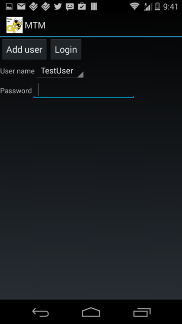
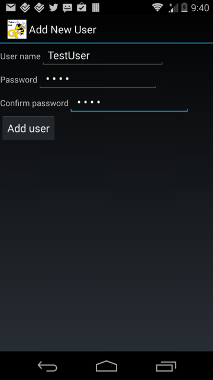
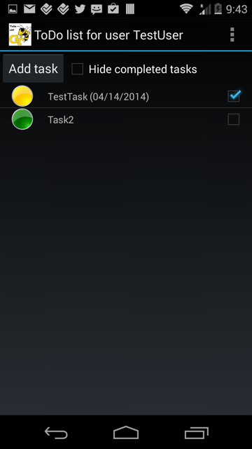
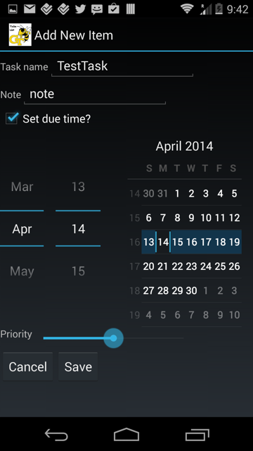
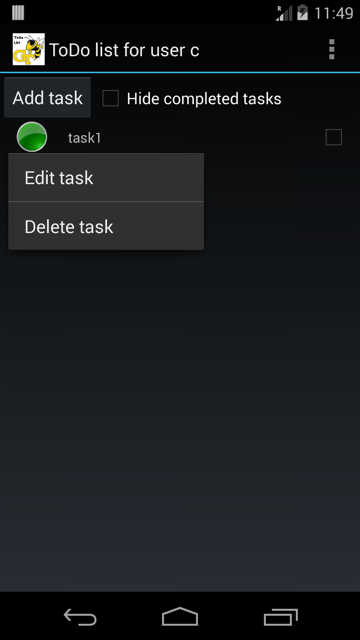
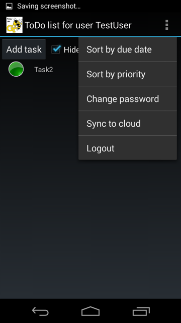
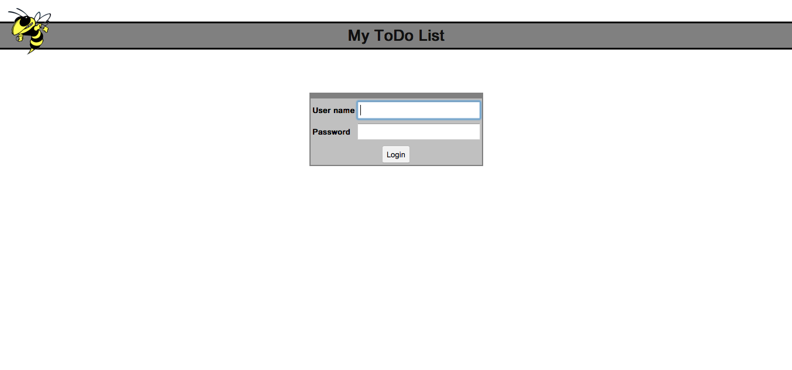
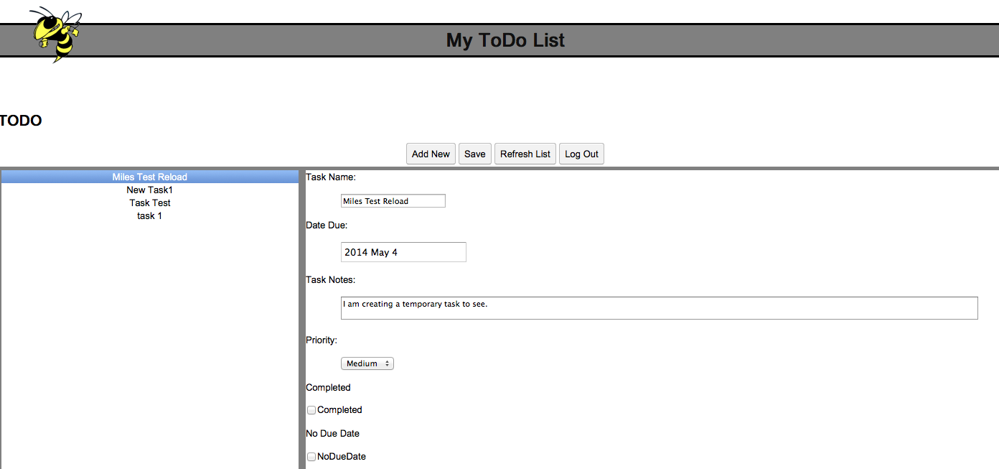
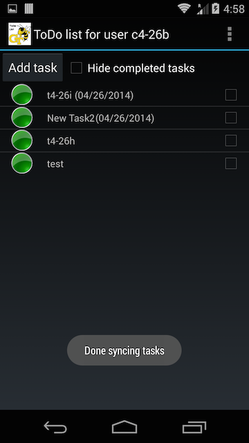

# User Manual – Project 3 – Team 25

##Contents 

###1. [Welcome](#welcome)

###2. [Android App](#android)
####2.1 [Start Up](#startup)
####2.2 [Tasks](#tasks)
####2.3 [Options](#settings)

###3. [Web App](#web) 
####3.1 [Start Up](#webstartup)
####3.2 [Tasks](#webtasks)

###4. [Synchronization](#sync) 
####4.1 [Overview](#syncoverview)
####4.2 [Sync Process](#syncprocess)

##1.  Welcome
Welcome to __MyToDoApp__!  We hope it will be a fun and productive tool to track your daily tasks.  Thank you for trying the software, and please let us know how it works for you.

The software actually consists of two applications: a native Android application and a web-based interface.  The two applications are able to share data, permitting you to access your to-do list from virtually anywhere.  We will discuss the Android app first.

##2.  Android App

###2.1  Start Up

__Registering an Account__

Upon startup you will be presented with the Login Screen:
  
  
_Initial Login Screen_

New users are required to register by clicking the `Add user` button which will bring you to the Add User Screen:

  
_Add New User Screen_

Registration permits multiple users to utilize the app and enables cloud syncing capability.  We recommend using your email for your user name.  After entering a name and password, press the `Add user` button.  You will then be brought back to the Login Screen where you can select your user name and enter your password to begin using the app.

###2.2  Tasks

__Creating Tasks__

To create a new task press the `Add task` Button on the top of the task list:

  
_Task List Screen_

After pressing the button the following view will appear: 

  
_Add Task Screen_

Fill in the information as needed and press `Save` when complete.  Note that only the Task Name is required.  The other information is optional and is provided with default values.

__Editing Tasks__

To edit a previously created task, long-tap on the task which will bring up the a menu to either edit or delete the task:

  
_Task Menu_

If you select `Edit task` it will bring you to the same screen you used to create the task.  You will then be able to change and save any of the task data

__Delete Tasks__

To delete a previously created task, long-tap on the task which will bring up the a menu to either edit or delete the task.  If you select `Delete task` it will confirm that you want to delete the task.  __Warning:__ deleting a task is permanent!

__Completed Tasks__

From the main Task List you can mark a task complete by checking the box to the right of the task.  Marking a task complete does not delete it.  If you do not want to show your completed tasks, simply check the box to `Hide completed task`.

###2.3  Options

From the task list screen press the Android Options Menu icon in the upper right corner to display the application options:

  
_Options Menu_

From here you can:

* _Sort by due date:_ Sorts the task list by earliest due date first
* _Sort by priority:_ Sorts the task list by highest priority first
* _Change password:_ Brings you to the Add User screen to permit you to change your password
* _Sync to cloud:_ Manually syncs your data to the web application.  Note that this occurs automatically every time you login
* _Logout:_ Logs the current user out, requiring a password to view your data

##3.  Web App

###3.1  Start Up
Start the Web Application (preferably FireFox, Chrome, or Safari) by going to the following webpage [team25-project3.appspot.com](http://team25-project3.appspot.com)  The following webpage should appear:

 

Type in user login information and press login.  If the provided information is invalid, an error will appear just below the password box in the center of the screen.

<b>*NOTE: User ID's for the application are entered on the Android application and transferred to the web application through the synchronization process. If you want to create a new user, please use the Android application. </b>

###3.2  Tasks
Once logged in the following screen will appear.
 
To view or edit a task, select one of the items on the left side of the screen. Once selected, the task information will appear in the corresponding fileds on the right side of the screen, permitting editing.  After editing a task, click `Save` to store the changes.

To create a new task, select the `Add New` button.  The task fields will then be editable.  Don't forget to save the task when you are finished.

To check the datastore for any updates made to the cloud storage press the `Refresh Lish` button.  The webapp will retrieve the task from the datastore, rebuilding the list that the webapp works with. 
   

##4.  Synchronization

###4.1  Overview
Each application maintains its own data storage for both user ids and the associated tasks. The MTM-WTM application has the ability to synchronize the data between the Android app and the Web Application. 

There are some key considerations to keep in mind with the  synchronization process:

1) Synchronization is initiated from the Android application and allows for the bi-directional transfer of user and task data between the two data stores.

2) The Android app will automatically attempt a synchronization on startup. A synchronization can also be initiated manually from within the Android app from the Action Bar.

3) An important consideration is conflict management between the two data stores. Tasks can be edited on either the WTM or MTM, therefore there is always a possibility of conflicting data between the two stores. Conflicts are managed by tracking the last edit time and the latest edit will always take priority. 

4) Once the synchronization process is completed, both data stores will contain the identical tasks that had been entered for the user.

###4.2  Synchronization Process
The synchronization process is initiated by selecting the "Sync to Cloud" option on the pull down as shown in the diagram below:

 

Once the synchronization is successfully completed, a status message is displayed at the bottom of the screen as shown below. An unsuccessful synchronization will return a message indicating the appropriate status.

 

